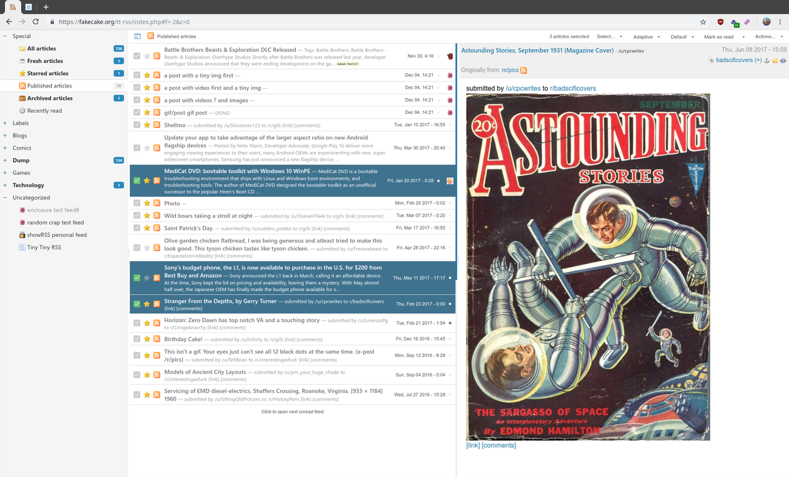

# Tiny Tiny RSS pour YunoHost

[](https://dash.yunohost.org/appci/app/ttrss)    
[](https://install-app.yunohost.org/?app=ttrss)

*[Read this readme in english.](./README.md)*
*[Lire ce readme en français.](./README_fr.md)*

> *Ce package vous permet d'installer Tiny Tiny RSS rapidement et simplement sur un serveur YunoHost.
Si vous n'avez pas YunoHost, regardez [ici](https://yunohost.org/#/install) pour savoir comment l'installer et en profiter.*

## Vue d'ensemble

Tiny Tiny RSS est un lecteur et agrégateur de flux d'actualités (RSS/Atom) en ligne gratuit et open source.


**Version incluse :** 20220301~ynh1

**Démo :** https://demo.yunohost.org/ttrss/

## Captures d'écran



## Avertissements / informations importantes

### Default login credentials

- Username: `admin`
- password: `password`
## Documentations et ressources

* Site officiel de l'app : http://tt-rss.org
* Documentation officielle de l'admin : https://git.tt-rss.org/git/tt-rss/wiki
* Dépôt de code officiel de l'app : https://git.tt-rss.org/git/tt-rss
* Documentation YunoHost pour cette app : https://yunohost.org/app_ttrss
* Signaler un bug : https://github.com/YunoHost-Apps/ttrss_ynh/issues

## Informations pour les développeurs

Merci de faire vos pull request sur la [branche testing](https://github.com/YunoHost-Apps/ttrss_ynh/tree/testing).

Pour essayer la branche testing, procédez comme suit.
```
sudo yunohost app install https://github.com/YunoHost-Apps/ttrss_ynh/tree/testing --debug
ou
sudo yunohost app upgrade ttrss -u https://github.com/YunoHost-Apps/ttrss_ynh/tree/testing --debug
```

**Plus d'infos sur le packaging d'applications :** https://yunohost.org/packaging_apps